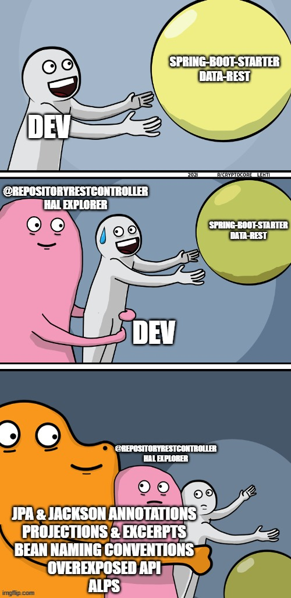

# Spring Data REST considered harmful

Thoughts on the Spring Data REST library.

## What is it

Spring Data REST takes your public `@Repository` classes and automatically creates REST endpoints allowing CRUD operations on objects managed by those Repositories.

The framework follows HATEOAS principle to provide resource discoverability. Specifically, it uses HAL format for representation. It also provides querying abilities out-of-the-box, including sorting and pagination.

## TLDR

## Pros

* Allows to kick off a new CRUD REST service quickly and with little to no boilerplate
* Transparently supports different data stores, including relational, non-relational and graph DBs
* Enforces usage of standards and best practices out-of-the-box
* Allows easier integration with other Spring projects, like Security or Expression Language

## Cons

* Provides a lot of functionality implicitly, which may lead to overexposed APIs and/or security issues
* Requires intimate knowledge of Spring Data REST specifics and internal workings for customization of the implicit Spring Data REST behavior
* Has a steep learning curve once finer control over generated behavior is required
* Promotes using same classes in both Domain Model and Data Transfer Object roles
* Lacks popularity, compared with other Spring projects, which means there isn't much more information on the internet than the official documentation

## Personal note

I personally encountered Spring Data REST in three different services, and in all of those it brought more pain than relief. In two of those three cases my team and I managed to remove Spring Data REST, which brought positive impact in velocity, correctness, performance, readability and other aspects. This probably makes my opinion biased, so please be aware of that.

My main problem with Spring Data REST is that it's often considered as a good way for junior / middle level developers to quickly create an MVP. In my experience though, to use Spring Data REST effectively one must be quite proficient in data modeling, REST best practices, underlying data store workings, Spring framework internals and conventions, _and_ Spring Data REST specifics. And since Spring Data REST is quite niche, I don't think getting deep understanding of it is a good way to spend time.

With Spring Data REST it is absolutely mandatory to thoroughly read documentation to understand what are the default conventions and expectations of this framework. It is also very important to model your data in a manner compatible with Spring Data REST. This manner isn't necessarily bad, but with limited customization options there's little room for error. To me this means that it's extremely easy to misuse Spring Data REST and end up in a spot when evolving the application becomes unnecessarily hard.

The default tool to explore a Spring Data REST API is HAL Explorer. It is similar in purpose to Swagger UI, but its targeted at exploring HATEOAS + HAL APIs, so its look and feel is quite different from Swagger UI. It isn't hard to use HAL Explorer, but it's another thing developers, QAs and technical consumers will have to get acquainted with. 
Note that Springdoc library supports Spring Data REST since recently, but the support is limited.

I'd like to end by saying that it is possible to build a maintainable, performant and secure services with Spring Data REST. In my opinion though, to do it one _must_ be very familiar with both the Spring Data REST framework and foundations it is build on top of to achieve this. And this cost 

## References

* [Spring Data REST reference documentation](https://docs.spring.io/spring-data/rest/reference/index.html)
* [Spring Data REST source code](https://github.com/spring-projects/spring-data-rest)
* [HATEOAS](https://en.wikipedia.org/wiki/HATEOAS)
* [JSON Hypertext Application Language](https://datatracker.ietf.org/doc/html/draft-kelly-json-hal)
* [Example Maven project](https://github.com/sa1nt/spring-data-rest-considered-harmful/tree/main/spring-data-rest-projections)
* [Catalog of Patterns of Enterprise Application Architecture](https://martinfowler.com/eaaCatalog/)
* [Springdoc Spring Data Rest support](https://springdoc.org/#spring-data-rest-support)
* [Edgar Dijkstra: Go To Statement Considered Harmful](https://homepages.cwi.nl/~storm/teaching/reader/Dijkstra68.pdf)
